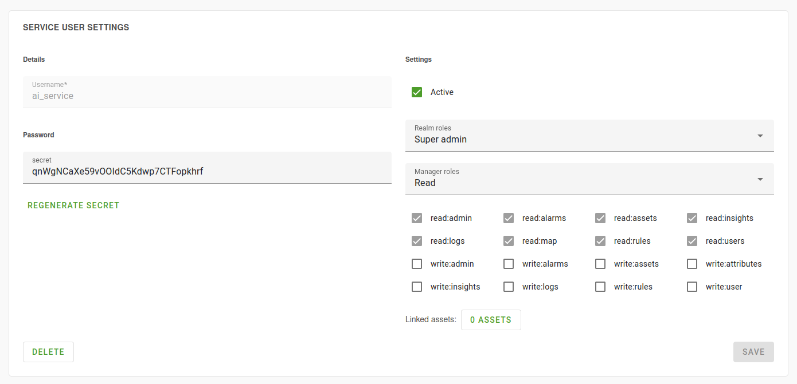

# OpenRemote AI Service
Integration for OpenRemote Platform to connect with an any of the popular LLMs

---
[](https://www.python.org/)
[](https://github.com/Openremote-Combi-group/ai-service/blob/main/LICENSE.txt)

## Supported LLMs
- [Ollama](https://ollama.com/) (Only models that support 'tool calling')


## Getting started

Prerequisites
- OpenRemote deployed
- Docker installed

1. Create a service user in OpenRemote

**Note: The service user only needs read permission.**

2. Edit your docker-compose file to include the following services:
```yaml
services:
  ollama:
    image: ollama/ollama:latest
    volumes:
      - ollama_data:/root/.ollama
  
  ai_service:
    image: openremote/ai_service:latest
    environment:
      OLLAMA_HOST: 'http://ollama:11434' # This point to your ollama instance
      OPENREMOTE_HOST: 'http://manager:8080' # This point to the OpenRemote Manager
      OPENREMOTE_CLIENT_ID: 'your_id' # Fill the 'Username' of the service user here.
      OPENREMOTE_CLIENT_SECRET: '<your_secret>' # Fill in the 'secret' of the service user here.

volumes:
  ollama_data:
```

3. Redeploy the docker compose file and your services should be running.


## Development guide

### Libraries & Frameworks
- [Uvicorn (Web server)](https://www.uvicorn.org/)
- [FastAPI (ASGI framework)](https://fastapi.tiangolo.com/)
- [Langchain (LLM integration)](https://www.langchain.com/)
- [OpenRemote Client](https://github.com/Spider-Frog/openremote_client)


### Installation

Prerequisites
- Python 3.10+ installed
- Docker installed
- OpenRemote running [Developer guide](https://docs.openremote.io/docs/category/developer-guide)

1. Clone repository
```shell
git clone https://github.com/Openremote-Combi-group/ai-service
```

2. Create virtual environment
```shell
python -m venv <venv>
```

3. Activate environment
```shell
# Linux / Mac
source <venv>/bin/activate

# Windows
<venv>\Scripts\activate.bat
```

4. Install requirements
```shell
pip install -r requirements.txt
```

5. Create a service user in OpenRemote

**Note: The service user only needs read permission.**

6. Set environment variables
```shell
export OPENREMOTE_HOST=<openremote_manager_url>
export OPENREMOTE_CLIENT_ID=<openremote_client_id>
export OPENREMOTE_CLIENT_SECRET=<openremote_client_secret>

export OLLAMA_HOST=http://localhost:11434
```

7. Start the Docker containers needed for development
```shell
docker compose -f docker-compose.dev.yml up
```

8. Start development servers
```shell
uvicorn api:app --reload
```